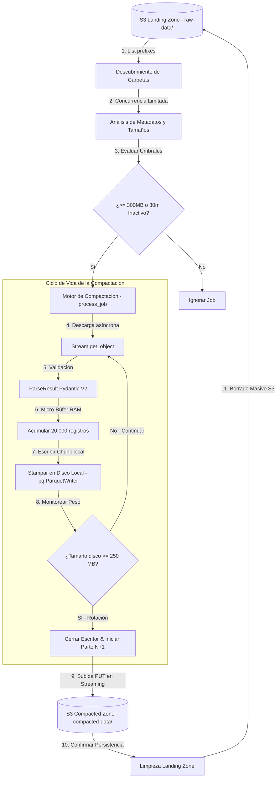

# Jobs — Catálogo de Trabajos Programados y Procesamiento Batch

El módulo de **Jobs** es un contenedor extensible diseñado para alojar tareas programadas, scripts de mantenimiento, procesos de ETL y cualquier tarea batch periódica necesaria para la plataforma de scraping distribuido. 

Este directorio está diseñado para crecer de forma modular, permitiendo añadir nuevos scripts independientes sin interferir con la lógica de los trabajos existentes.

---

## 📂 Estructura del Módulo

Cualquier nuevo script batch debe colocarse en la raíz de este módulo y definir sus propios esquemas o interfaces dentro de las carpetas correspondientes:

```text
jobs/
├── config/              # Parámetros y variables de entorno globales
├── interfaces/          # Modelos de validación (Pydantic) específicos de cada job
├── test/                # Suite de pruebas unitarias e integración de los jobs
├── README.md            # Documentación general y catálogo de jobs
└── compact_s3.py        # [Job] Compactador de Data Lake (Primer job activo)
```

---

## 📖 Catálogo de Jobs Activos

---

### 1. Compactador de Data Lake (`compact_s3.py`)

Este job es responsable de mitigar el **problema de los archivos pequeños** (*Small Files Problem*). Consolida los ficheros JSON Lines de la Landing Zone en S3, transformándolos a formato columnar estructurado de alta densidad (**Parquet**) con compresión **ZSTD**.

#### 🏗️ Arquitectura del Job de Compactación
El proceso se ejecuta de manera asíncrona concurrente con `asyncio` y un pool de hilos nativos para la escritura de chunks a disco local:



#### 🚀 Características Clave del Job
* **Escritura Incremental en Disco Local (RAM Plana)**: En lugar de cargar todo el dataset (hasta 1M de registros) en listas nativas de Python (Heap Inflation), el job escribe bloques binarios de **20,000 registros** a disco local temporalmente usando `pq.ParquetWriter`. Esto mantiene el consumo de RAM constante por debajo de los **60 MB** independientemente de si procesa 50,000 o 10,000,000 de filas.
* **Corte por Tamaño de Archivo Real**: El script monitorea el tamaño físico del archivo binario Parquet en disco (`os.path.getsize()`). Cuando cruza los **250 MB**, cierra el escritor y lo sube asíncronamente a S3 como la *Parte N*, abriendo un nuevo archivo temporal local para continuar. Esto garantiza archivos balanceados y óptimos para consultas SQL en el Data Lake.
* **Subida por Stream (Zero Heap Upload)**: Al subir los archivos Parquet a S3 mediante `aioboto3.client.put_object(Body=file_object)`, el payload se transmite por red en bloques directamente desde el disco sin cargarse por completo en la memoria virtual de Python.
* **Esquema Resiliente Columnar**: Estructura las consultas mediante tipado fuerte en las columnas de control analítico, pero empaqueta el contenido útil polimórfico en una columna `data` de tipo cadena JSON para prevenir roturas ante cambios en los campos extraídos de la web.

---

### 2. [Futuros Jobs] (Mantenimiento, Backups, Cargas ETL, etc.)
Para añadir un nuevo Job:
1. Crea tu archivo script en la raíz de `jobs/` (ej. `limpieza_temporales.py`).
2. Agrega las configuraciones necesarias en [jobs/config/settings.py](file:///C:/proyectos/WebScrapingDistributed/jobs/config/settings.py).
3. Añade su descripción técnica y su flujo en este catálogo para mantener la visibilidad arquitectónica del sistema.

---

## ⚙️ Configuración y Variables de Entorno Globales

El módulo comparte un objeto centralizado de configuración mediante `jobs/config/settings.py` alimentado por el archivo `.env` en su raíz:

| Variable | Tipo | Por Defecto | Descripción |
| :--- | :--- | :--- | :--- |
| `S3_ENDPOINT_URL` | String | `http://localhost:4566` | Endpoint del almacenamiento de objetos S3. |
| `S3_BUCKET_NAME` | String | `scraping-raw-data` | Nombre del bucket del Data Lake. |
| `S3_PREFIX_RAW_ZONE` | String | `row-data` | Carpeta virtual de la Landing Zone de entrada. |
| `S3_PREFIX_COMPACTED_DATA` | String | `compacted-data` | Carpeta virtual de destino para datos compactados Parquet. |
| `AWS_ACCESS_KEY_ID` | String | `test` | Clave de acceso de AWS. |
| `AWS_SECRET_ACCESS_KEY` | String | `test` | Clave secreta de acceso de AWS. |
| `DEFAULT_REGION_AWS` | String | `us-east-1` | Región por defecto de AWS. |

---

## 🛠️ Ejecución y Suite de Pruebas

### Lanzamiento de Jobs Individuales
Los jobs se invocan de forma independiente desde su raíz usando el gestor de dependencias `uv`:
```bash
# Lanzar el compactador de S3
uv run compact_s3.py

# Lanzar futuros jobs (ejemplo)
uv run limpieza_temporales.py
```

### Batería de Pruebas Integradas
Las pruebas se localizan en `jobs/test/` y simulan la infraestructura AWS usando un servidor HTTP local de Moto en memoria para aislamiento absoluto:
```bash
# Ejecutar todos los tests del módulo
uv run pytest

# Inspeccionar reporte de cobertura de código
uv run pytest --cov=. --cov-report=term-missing
```
