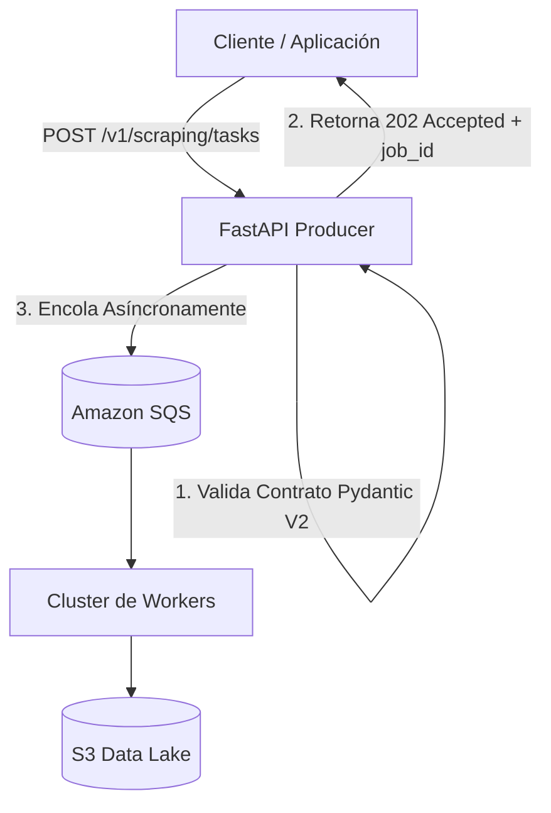
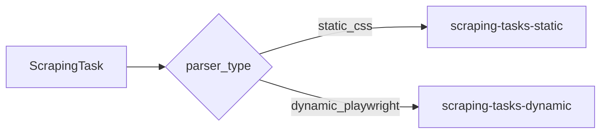

# Manual y Guía Avanzada de Uso de la API Producer

Esta guía es el **manual completo y detallado** para utilizar la API Producer del sistema `WebScrapingDistributed`. 

Explora desde los conceptos fundamentales del patrón **Fire and Forget** hasta las opciones avanzadas de extracción de datos, evasión anti-bot, hidratación JS de SPAs, interacciones DOM y gestión de sesiones persistentes.

---

## 📌 1. Arquitectura de Ingesta Asíncrona ("Fire and Forget")

La API Producer opera bajo el patrón de diseño **Fire and Forget** (`HTTP 202 Accepted`).



### ¿Por qué este diseño?
1. **Respuesta Instantánea (<15ms):** Liberación inmediata del cliente HTTP sin obligarle a mantener un socket abierto esperando a que el scraping (que puede durar de 1s a 30s) finalice.
2. **Deduplicación & Batch Enqueueing:** Valida el esquema JSON en tiempo real y agrupa las tareas en lotes de hasta 10 mensajes (`SendMessageBatch`) para Amazon SQS.
3. **Trazabilidad:** Cada solicitud requiere un `job_id` global que permite rastrear todo el ciclo de vida del raspado y consultar los datos consolidados en S3 o Parquet.

---

## 🚀 2. Endpoint Principal: Ingesta Masiva de Tareas

* **URL:** `POST http://localhost:8000/v1/scraping/tasks` *(o `http://localhost:30800/v1/scraping/tasks` en Kubernetes)*
* **Headers:** `Content-Type: application/json`

### 📋 Esquema Raíz de la Petición (`BulkTaskRequest`)

```json
{
  "job_id": "string (Obligatorio - ID del grupo de scraping)",
  "tasks": [
    "Array de objetos ScrapingTask (Mínimo 1 tarea)"
  ],
  "context": {
    "string": "any (Opcional - Metadatos globales asignados a todas las tareas del lote)"
  }
}
```

### 📩 Esquema de Respuesta Exitosa (`HTTP 202 Accepted`)

```json
{
  "job_id": "amazon-laptops-2026",
  "status": "accepted",
  "message": "El procesamiento ha comenzado en segundo plano."
}
```

---

## ⚙️ 3. Parámetros de Control y Resiliencia por Tarea (`ScrapingTask`)

Cada objeto dentro del array `tasks` acepta las siguientes propiedades de control:

| Propiedad | Tipo | Requerido | Por Defecto | Descripción / Uso Avanzado |
| :--- | :--- | :--- | :--- | :--- |
| `url` | `string` | **Sí** | - | URL válida (`HttpUrl`). Se valida sintácticamente en la ingesta. |
| `parser_type` | `string` | **Sí** | - | Motor de scraping: `"static_css"` o `"dynamic_playwright"`. |
| `parser_config` | `object` | **Sí** | `{}` | Objeto JSON con los selectores y parámetros específicos del motor. |
| `priority` | `integer` | No | `1` | Prioridad de ejecución de 1 (baja) a 10 (alta). |
| `max_retries` | `integer` | No | `3` | Intentos máximos ante errores de red/5xx antes de derivar a la DLQ (máx 10). |
| `context` | `object` | No | `{}` | Diccionario de metadatos que viaja con la tarea (ej: `{"categoria_id": 99}`). |

---

## 🛠️ 4. Selección del Motor de Scraping (`parser_type`)

El sistema cuenta con dos motores especializados físicamente segregados en colas de SQS distintas:



### A. Motor Estático: `static_css`
* **Tecnología:** `httpx` + `curl_cffi` (Impersonación de firmas TLS JA3/JA4) + `BeautifulSoup`.
* **Cuándo Usarlo:** Webs tradicionales renderizadas en servidor (SSR), blogs, prensa, sitios con HTML plano o APIs públicas.
* **Ventajas:** **Ultrarrápido (~200ms-500ms por página)**, consumo mínimo de RAM y CPU, libre de bloqueos Cloudflare TLS.
* **Concurrencia:** Alta (hasta 60 tareas por worker).

### B. Motor Dinámico: `dynamic_playwright`
* **Tecnología:** Chromium Headless + `playwright-stealth` + Client Hints coherentes.
* **Cuándo Usarlo:** SPAs (Single Page Applications creadas en React, Vue, Angular), webs con scroll infinito, hidratación tardía de JS, o páginas que requieren clicks en banners de cookies/popups.
* **Ventajas:** Ejecuta JavaScript real, renderiza locators en DOM dinámico y filtra honeypots mediante evaluación batch en C++/V8 (~15ms).
* **Concurrencia:** Controlada (3 tareas por worker) con reciclaje automático de RAM cada 25 tareas.

---

## 🎯 5. Esquema de Extracción Estructurada (`parser_config`)

El objeto `parser_config` utiliza el motor **UniversalDOMExtractor** para extraer exactamente los datos que necesites.

### Configuración del Campo `FieldDefinition`:
Cada clave dentro del diccionario `selectors` puede definirse de dos formas:
1. **Selector Simple (`string`):** Extrae directamente el texto interior limpio del elemento HTML.
2. **Especificación Detallada (`FieldSpec` object):** Permite extraer atributos HTML (`href`, `src`, `data-*`), definir valores por defecto y solicitar listas de elementos.

```json
{
  "selector": "string (Selector CSS o XPath)",
  "attribute": "string (Opcional - Atributo HTML a extraer, ej: 'href', 'src', 'data-sku')",
  "default": "any (Opcional - Valor fallback si el elemento no existe en el DOM)",
  "multiple": "boolean (Opcional - Si es true, retorna lista de todos los coincidentes)"
}
```

---

### Escenarios de Uso del `parser_config`

#### Escenario 1: Extracción de Entidad Única (Ficha de Producto / Noticia)
No se proporciona el campo `container`. Todos los selectores se buscan a nivel raíz de todo el documento HTML.

```json
{
  "parser_type": "static_css",
  "parser_config": {
    "selectors": {
      "titulo": "h1.product-title",
      "precio_actual": "span.current-price",
      "sku": {
        "selector": "div#product-detail",
        "attribute": "data-product-sku",
        "default": "DESCONOCIDO"
      },
      "url_imagen": {
        "selector": "img.main-image",
        "attribute": "src"
      }
    }
  }
}
```
**Resultado en S3 Data Lake:** Un objeto JSON individual con los campos mapeados.

---

#### Escenario 2: Extracción de Colección / Listado Repetitivo (`container`)
Se define el campo `container` con el selector CSS del bloque repetitivo (tarjeta, fila de tabla, item). El extractor iterará sobre cada contenedor y buscará los selectores **relativos a cada item**.

```json
{
  "parser_type": "static_css",
  "parser_config": {
    "container": "article.ad-card",
    "selectors": {
      "titulo": "h2.ad-title",
      "precio": "span.price",
      "enlace": {
        "selector": "a.card-link",
        "attribute": "href"
      },
      "etiquetas": {
        "selector": "span.tag-badge",
        "multiple": true
      }
    }
  }
}
```
**Resultado en S3 Data Lake:** Una lista de objetos JSON extraídos de cada tarjeta presente en la página.

> [!TIP]
> Si el propio elemento contenedor es el que contiene el atributo que deseas extraer (por ejemplo, el enlace `<a class="ad-card" href="...">`), puedes usar `"selector": "self"` o `"selector": ""` dentro de `FieldSpec` para hacer referencia al contenedor mismo.

---

## 🎭 6. Opciones Avanzadas del Motor Dinámico (`dynamic_playwright`)

Cuando usas `"parser_type": "dynamic_playwright"`, puedes incluir parámetros adicionales en `parser_config` para controlar el navegador Chromium:

```json
{
  "parser_type": "dynamic_playwright",
  "parser_config": {
    "container": "article.item-card",
    "selectors": {
      "titulo": "h3",
      "precio": "span.price"
    },
    "timeout_ms": 20000,
    "wait_until": "networkidle",
    "wait_for_selector": "article.item-card",
    "fixed_sleep_s": 2.5,
    "scroll_to_bottom": true,
    "click_selectors": [
      "#onetrust-accept-btn-handler",
      "button.close-popup"
    ]
  }
}
```

### Guía de Parámetros Dinámicos:

* **`timeout_ms`** *(int, default: 30000)*: Tiempo límite en milisegundos para la navegación y carga.
* **`wait_until`** *(string, default: "domcontentloaded")*: Estado del ciclo de vida a esperar. Opciones: `"domcontentloaded"`, `"networkidle"`, `"load"`, `"commit"`.
* **`wait_for_selector`** *(string, opcional)*: CSS Selector específico que debe aparecer en el DOM antes de extraer datos (ideal para componentes React/Vue con hidratación tardía).
* **`fixed_sleep_s`** *(float, default: 0.0)*: Tiempo de espera adicional en segundos tras la carga (útil para esperar animaciones CSS o peticiones XHR secundarias).
* **`scroll_to_bottom`** *(boolean, default: false)*: Si es `true`, ejecuta scroll suave hasta el fondo de la página para activar **Lazy Loading** de imágenes e ítems.
* **`click_selectors`** *(list[str], opcional)*: Lista ordenada de selectores CSS sobre los que hacer click antes de la extracción (ej: aceptar banners de cookies, cerrar modales de suscripción). Envuelta en tiempos de espera seguros no bloqueantes.

---

## 🌐 7. Gestión de Proxies y Sticky Sessions (`context.sticky_session_id`)

Si necesitas realizar scraping navegando en varias páginas reteniendo la **misma dirección IP y la misma sesión de cookies** (por ejemplo, paginaciones o procesos con login):

Incluye la clave `sticky_session_id` dentro del objeto `context` de la tarea:

```json
{
  "url": "https://example.com/categoria?page=2",
  "parser_type": "static_css",
  "parser_config": {
    "selectors": { "titulo": "h1" }
  },
  "context": {
    "sticky_session_id": "usuario-sesion-89412"
  }
}
```

El gestor de proxies calculará un hash consistente y garantizará que todas las peticiones con el mismo `sticky_session_id` salgan por el **mismo nodo proxy estático o gateway residencial**.

---

## 🧪 8. Ejemplos Prácticos Completos Listos para Usar

### Ejemplo 1: Ingesta Masiva SSR Estática (Milanuncios / Clasificados)

```powershell
Invoke-RestMethod -Uri "http://localhost:8000/v1/scraping/tasks" -Method Post -ContentType "application/json" -Body '{
  "job_id": "milanuncios-pc-ryzen-2026",
  "tasks": [
    {
      "url": "https://www.milanuncios.com/ordenadores-de-segunda-mano/ryzen-5.htm",
      "parser_type": "static_css",
      "parser_config": {
        "container": "article.ma-AdCardV2",
        "selectors": {
          "titulo": "h2.ma-AdCardV2-title",
          "precio": ".ma-AdPrice-value",
          "ubicacion": ".ma-AdLocation-text",
          "enlace": {
            "selector": "a.ma-AdCardListingV2-TitleLink",
            "attribute": "href"
          }
        }
      },
      "priority": 5
    }
  ]
}'
```

---

### Ejemplo 2: Ingesta SPA Dinámica con Scroll y Clicks en Banner (Wallapop)

```powershell
Invoke-RestMethod -Uri "http://localhost:8000/v1/scraping/tasks" -Method Post -ContentType "application/json" -Body '{
  "job_id": "wallapop-hardware-2026",
  "tasks": [
    {
      "url": "https://es.wallapop.com/app/search?keywords=placa%20base%20am4",
      "parser_type": "dynamic_playwright",
      "parser_config": {
        "container": "[class*=\"RetrievalItemCard__group\"]",
        "selectors": {
          "titulo": "[class*=\"title\"]",
          "precio": "[class*=\"currentPrice\"]",
          "enlace": {
            "selector": "a[href*=\"/item/\"]",
            "attribute": "href"
          }
        },
        "wait_for_selector": "[class*=\"RetrievalItemCard__group\"]",
        "scroll_to_bottom": true,
        "click_selectors": [
          "#onetrust-accept-btn-handler"
        ],
        "timeout_ms": 25000
      },
      "priority": 8
    }
  ]
}'
```

---

## 🔗 Enlaces Relacionados
* [README Principal del Sistema](../README.md)
* [README del Módulo Producer](README.md)
* [README del Módulo Worker](../worker/README.md)
* [README del Módulo Jobs](../jobs/README.md)
