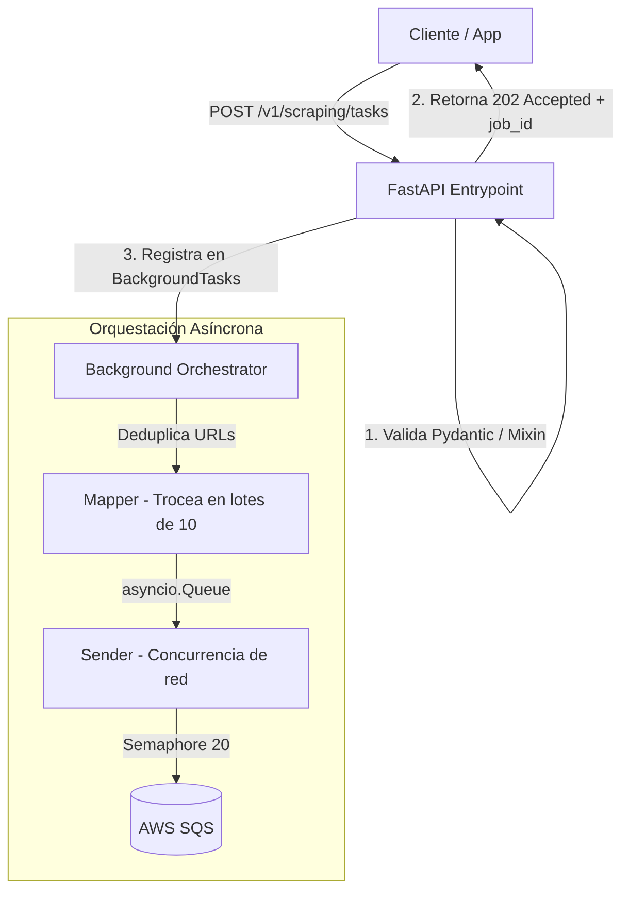

# Producer — API de Ingesta Asíncrona "Fire and Forget"

Microservicio de alto rendimiento desarrollado con **FastAPI** diseñado exclusivamente para recibir solicitudes masivas de scraping, validarlas rigurosamente en tiempo real contra contratos de datos estructurados y despacharlas de forma asíncrona hacia SQS, maximizando la concurrencia y minimizando la latencia de respuesta al cliente.

---

## 📌 Arquitectura y Patrones de Diseño

El Producer está concebido bajo el principio de **desacoplamiento total y procesamiento no bloqueante**. No realiza scraping; actúa como un portero de red ultra-eficiente que orquesta el trabajo entrante.



### 1. Patrón "Fire and Forget" (202 Accepted)

Para evitar que un cliente mantenga una conexión HTTP abierta mientras se procesan y encolan miles de peticiones (lo que degradaría la capacidad del servidor), el Producer:

- Valida los esquemas de entrada de forma síncrona en la API.
- Si es válido, delega el procesamiento y envío a la cola a `BackgroundTasks` de FastAPI.
- Responde inmediatamente con un código de estado `202 Accepted` y el `job_id` asociado.

### 2. Deduplicación de Redundancia en Ingesta

Antes de procesar la solicitud, el servicio realiza una limpieza instantánea de duplicados sobre el listado de entrada de URLs. Esto asegura que no se consuman recursos de colas ni procesamiento de red duplicado de manera inútil.

### 3. Pipeline de Encolado Concurrente (`mapper` ➡️ `sender`)

Para gestionar cargas masivas de manera estable sin desbordar el microservicio ni saturar los descriptores de archivos de red:

- **Pipeline en Memoria**: El proceso de encolado se divide en dos tareas asíncronas concurrentes coordinadas por una `asyncio.Queue` de tamaño acotado.
- **Mapper**: Se encarga de dividir el lote masivo en trozos estandarizados de máximo 10 tareas (el límite físico permitido por lote en la API de SQS) y les asigna un identificador único de lote (`batch_id`).
- **Sender**: Consume la cola y despacha los lotes concurrentemente.
- **Semáforo de Red**: Controla la concurrencia a nivel de socket mediante un semáforo asíncrono (`asyncio.Semaphore(20)`). Esto limita la cantidad de peticiones de red simultáneas en vuelo a SQS a un máximo de 20 lotes en paralelo, protegiendo al microservicio de latencias de red y evitando el estrangulamiento de la API de AWS.

---

## ⚡ Optimización de Red en AWS SQS

El adaptador asíncrono `SQSAioBotoAdapter` está diseñado con técnicas de sintonización para producción:

- **Sintonización de Conexiones HTTP**: Configura `Config(max_pool_connections=250)` sobre la sesión de `aioboto3`. Esto permite escalar a miles de hilos de red asíncronos concurrentes sin cuellos de botella por escasez de sockets abiertos.
- **Reutilización del Cliente (Singleton Asíncrono)**: El cliente SQS se inicializa una única vez al arrancar el servicio (`lifespan` de FastAPI) y se mantiene activo reutilizando sockets de red (Keep-Alive). Esto elimina el coste de negociación TLS y apertura de conexión TCP en cada lote.
- **Manejo de Fallos Parciales de SQS**: SQS puede procesar de forma exitosa parte de un lote y fallar en otros mensajes. El adaptador analiza de manera minuciosa el array de fallos `"Failed"` devuelto por AWS:
  - Recupera la tarea fallida localmente mediante mapeo por ID.
  - Discierne si el error es temporal o insalvable (basándose en la marca `SenderFault` de AWS). Si es un error del cliente (mal formato del cuerpo), no lo marca como reintentable (`retryable=False`).
  - Al apagar el microservicio de forma controlada, se invoca `.close()` en el adaptador para liberar limpiamente los sockets de red.

---

## 🛠️ Configuración y Variables de Entorno

El microservicio lee sus opciones desde el archivo `.env` en la raíz del proyecto. Las variables específicas del Producer son:

| Variable             | Tipo   | Por Defecto             | Descripción                                            |
| :------------------- | :----- | :---------------------- | :----------------------------------------------------- |
| `PRODUCER_PORT`      | `int`  | `8000`                  | Puerto de escucha de la API                            |
| `PRODUCER_HOST`      | `str`  | `localhost`             | Host para enlazar el servidor ASGI                     |
| `DEBUG_MODE`         | `bool` | `True`                  | Activa/Desactiva el modo recarga automática (`reload`) |
| `NUM_MAX_TASKS`      | `int`  | `10`                    | Tamaño máximo de lotes enviados a SQS (máx 10)         |
| `DEFAULT_REGION_AWS` | `str`  | `us-east-1`             | Región de AWS para las colas                           |
| `SQS_ENDPOINT_URL`   | `str`  | `http://localhost:9324` | URL local del emulador de AWS SQS (Floci)              |
| `SQS_QUEUE_URL`      | `str`  | `...`                   | URL física de la cola principal                        |

---

## 🚀 Arranque y Desarrollo Local

### 1. Requisitos e Instalación

Asegúrate de tener corriendo el emulador SQS en segundo plano (puedes levantarlo desde la raíz con `docker-compose up emulator-aws -d`).

Entra en la carpeta del servicio e instala las dependencias:

```bash
cd producer
uv sync
```

### 2. Ejecutar en Modo Desarrollo

Arranca el servidor ASGI con recarga automática:

```bash
uv run uvicorn main:app --reload --port 8000
```

La documentación Swagger interactiva estará disponible de forma automática en:
👉 [http://localhost:8000/docs](http://localhost:8000/docs)

---

## 🛣️ Endpoints de la API

### `POST /v1/scraping/tasks`

Ingesta y procesamiento asíncrono de un lote de tareas de scraping.

#### Ejemplo de Cuerpo de Solicitud (JSON):

```json
{
  "job_id": "mision-analisis-precios-2026",
  "tasks": [
    {
      "url": "https://example.com/producto/123",
      "parser_type": "static_css",
      "parser_config": {
        "selectors": {
          "titulo": "h1.product-title",
          "precio": "span.price-tag"
        }
      },
      "priority": 5,
      "max_depth": 1,
      "max_retries": 3
    }
  ],
  "context": {
    "tienda": "Amazon Spain",
    "categoria": "Electronica"
  }
}
```

> [!IMPORTANT]
> El campo `parser_config` se valida dinámicamente en tiempo real de acuerdo con lo requerido por el enum `parser_type`. Si envías propiedades incorrectas o ausentes, la API rechazará la petición con un error `422 Unprocessable Entity` detallando el esquema exacto que esperaba el validador antes de registrar nada en la cola.

#### Ejemplo de Respuesta (`202 Accepted`):

```json
{
  "job_id": "mision-analisis-precios-2026",
  "status": "accepted",
  "message": "El procesamiento ha comenzado en segundo plano."
}
```

---

## 🧪 Pruebas Unitarias y de Integración

Para ejecutar la suite de pruebas del Producer, que valida la consistencia de los modelos Pydantic, el comportamiento dinámico de los mixins y el adaptador SQS:

```bash
cd producer
uv run pytest
```

Las pruebas simulan la comunicación asíncrona utilizando entornos de prueba mockeados y conexiones a colas temporales locales para garantizar la robustez de los controladores y servicios.
