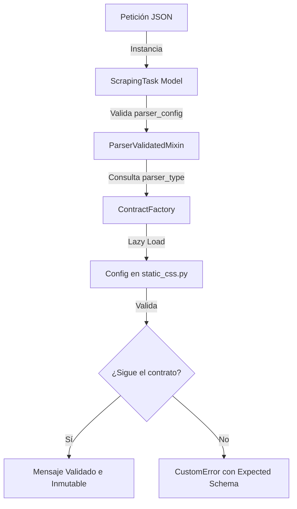

# Shared — Biblioteca de Modelos y Utilidades Comunes

Módulo centralizador de contratos de datos, validaciones contractuales y utilidades transversales que proporciona cohesión arquitectónica y desacoplamiento en el sistema de scraping distribuido.

Este paquete es compartido e integrado de forma nativa por el **Producer** (para validar en la ingesta) y el **Worker** (para procesar y extraer).

---

## 📌 Propósito y Arquitectura

En sistemas distribuidos orientados a eventos, la **coherencia del contrato** es crítica. Si el productor envía un mensaje con una estructura que el consumidor no puede entender, el sistema falla de manera silenciosa.

`shared` resuelve esto actuando como la **única fuente de verdad** (*Single Source of Truth*), garantizando que:
1. Toda tarea de scraping que viaje por SQS cumpla estrictamente el mismo esquema validado por **Pydantic**.
2. Las configuraciones dinámicas de extracción (como selectores CSS) se validan antes de entrar en la cola.
3. El sistema de logging sea uniforme, estructurado en JSON para observabilidad en la nube y resistente a fallos de serialización.

---

## 📁 Estructura del Módulo

```py
shared/
├── pyproject.toml              # Configuración de empaquetado (Hatchling) y dependencias
├── README.md                   # Esta documentación
└── shared/                     # Código fuente del paquete
    ├── __init__.py             # Exportaciones públicas de modelos y utilidades
    ├── logging.py              # Logger unificado, estructurado y resiliente
    └── models/                 # Modelos de validación Pydantic
        ├── __init__.py
        ├── scraping_task.py    # Modelo y contrato del mensaje SQS
        ├── batch_task_response.py # Modelos de respuesta REST para lotes
        ├── parse_type/         # Tipos y motores de scraping soportados
        │   ├── __init__.py
        │   └── enum.py         # Enum de ParserType (static_css, playwright_amazon)
        └── parse_config/       # Validación contractual y perezosa de motores
            ├── __init__.py
            ├── base.py         # Clase base inmutable (BaseParserConfig)
            ├── factory.py      # Factory para carga perezosa de configuraciones
            ├── validators.py   # Mixin interceptor de validación dinámica
            └── static_css.py   # Contrato específico del motor Static CSS
```

---

## 🛠️ Componentes Clave

### 1. Contratos de Datos Estrictos (`shared.models`)

#### `ScrapingTask`
Es el modelo de datos principal que representa una tarea individual en la cola de mensajería SQS.

```python
from shared.models import ScrapingTask

# Estructura del contrato de mensajería SQS:
# - task_id: UUID de trazabilidad y de-duplicación.
# - batch_id / job_id: Agrupadores de lotes de scraping.
# - url: URL válida a extraer (HttpUrl).
# - parser_type: Motor a utilizar (Enum ParserType).
# - parser_config: Diccionario con la configuración del parser.
# - priority: Prioridad de ejecución (1 a 10).
# - retry_count / max_retries: Control de reintentos y tolerancia a fallos.
# - context: Metadatos extra que viajan con el mensaje (ej: ID de categoría).
```

#### Respuestas REST por Lotes
- **`BatchResponse`**: Retorna el identificador de lote (`batch_id`), un resumen agregador (`SummaryBatchResponse`) con el conteo de tareas enviadas/fallidas y el desglose de errores (`ErrorsBatchResponse`) si las URLs o configuraciones fallaron en la validación inicial.

---

### 2. Validación Dinámica de Contratos (Factory + Mixin)

Uno de los diseños más avanzados del sistema es la validación dinámica en la ingesta. Cada motor de scraping requiere parámetros distintos (por ejemplo, `static_css` requiere selectores CSS y esperar a un elemento, mientras que un futuro motor de IA o Playwright requerirá selectores de campos o interacciones complejas).

Para validar esto sin acoplar los esquemas de forma rígida:



- **`BaseParserConfig`**: Define las reglas para los submódulos. Es inmutable (`frozen=True`) para proteger los hilos de ejecución concurrentes y no permite campos ajenos (`extra='forbid'`).
- **`ContractFactory`**: Implementa **Carga Perezosa (Lazy Load)**. Lee el valor del `ParserType` e importa dinámicamente el submódulo de configuración correspondiente (ej. `static_css.py`), extrayendo su clase `Config` en tiempo de ejecución.
- **`ParserValidatedMixin`**: Mixin de Pydantic que intercepta la validación de `parser_config`. Si la validación contra el submódulo cargado falla, recopila el esquema esperado y lanza una excepción limpia (`invalid_parser_config`) que la API intercepta y devuelve de forma legible al usuario.

#### Ejemplo de Contrato Específico (`static_css.py`):
```python
class Config(BaseParserConfig):
    selectors: Dict[str, str] = Field(..., min_length=1)  # Mapeo obligatorio de selectores
```

---

### 3. Logger Unificado y Estructurado (`shared.logging`)

El sistema incluye una clase de logging altamente optimizada para desarrollo local y entornos en la nube:

- **Formateado Coloreado (`StyleFormatter`)**: Muestra logs estructurados legibles con realce de colores ANSI según la severidad (`INFO`, `WARNING`, `ERROR`, `DEBUG`) en la terminal local.
- **Contexto JSON Enriquecido**: Permite adjuntar diccionarios de metadatos a los mensajes de log de forma limpia:
  ```python
  log.info("Tarea encolada con éxito", context={"task_id": "123", "priority": 5})
  ```
- **Tolerancia Extrema a Fallos**: El logger implementa un serializador universal (`_universal_serializer`) adaptado para serializar de manera segura objetos complejos, Pydantic, fechas, UUIDs y Decimales. Si ocurre un fallo crítico de serialización (por ejemplo, referencias circulares), el logger lo intercepta y escribe un log de emergencia, garantizando que **el microservicio nunca se caiga debido a un fallo en la fase de logueo**.

---

## 📥 Instalación en Desarrollo Local

Este paquete está configurado como un módulo distribuible local. Para instalarlo o enlazarlo en tus microservicios locales:

Con el gestor **uv** en la raíz del proyecto, las dependencias del workspace se sincronizan de forma automática en los entornos virtuales de los microservicios:

```bash
# Sincronizar dependencias locales en el microservicio
cd producer
uv sync
```

O si deseas forzar la reinstalación del paquete local shared:
```bash
uv sync --reinstall-package shared
```

---

## ➕ Cómo añadir un Nuevo Parser al Sistema

Para expandir el sistema con un nuevo motor (ej. `playwright_amazon`):

1. **Añadir el Tipo**: En `shared/shared/models/parse_type/enum.py`, agrega el nuevo valor al Enum:
   ```python
   class ParserType(str, Enum):
       STATIC_CSS = "static_css"
       PLAYWRIGHT_AMAZON = "playwright_amazon"
   ```
2. **Crear su Contrato**: En `shared/shared/models/parse_config/`, crea un archivo que coincida exactamente con el valor del enum (ej. `playwright_amazon.py`):
   ```python
   # shared/shared/models/parse_config/playwright_amazon.py
   from pydantic import Field
   from .base import BaseParserConfig

   class Config(BaseParserConfig):
       product_asin: str = Field(..., min_length=10, max_length=10)
       extract_reviews: bool = Field(default=True)
   ```
3. ¡Listo! La `ContractFactory` importará dinámicamente tu nuevo esquema y el Producer validará de forma inmediata las nuevas peticiones REST correspondientes a `playwright_amazon`.
