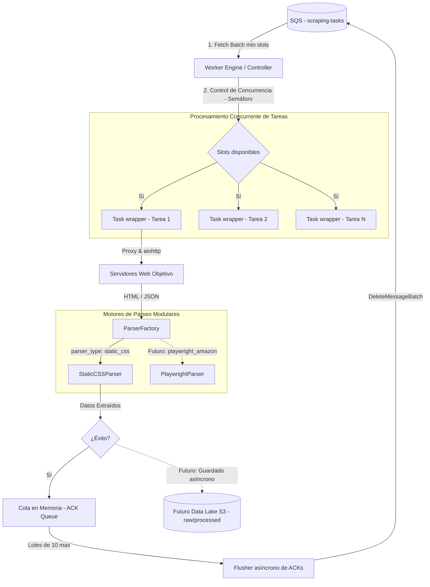
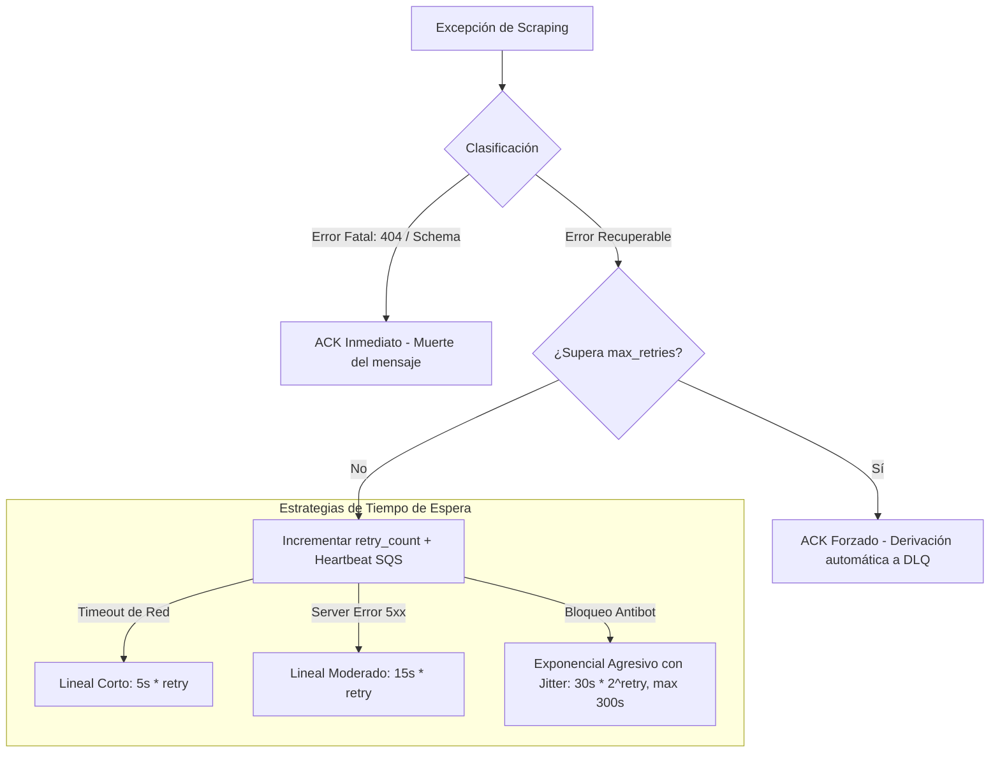

# Worker — Motor Concurrente de Extracción y Resiliencia

El **Worker** es el núcleo de ejecución asíncrono y de alto rendimiento del sistema. Su única responsabilidad es consumir tareas de scraping de la cola SQS de manera eficiente, evadir bloqueos de red mediante rotación inteligente de proxies, extraer los datos requeridos utilizando motores de parseado modulares y gestionar la tolerancia a fallos mediante estrategias adaptativas de reintentos.

---

## 🏗️ Arquitectura del Motor de Ejecución

El Worker está diseñado bajo un enfoque **no bloqueante y concurrente** utilizando el bucle de eventos de `asyncio` y clientes de red asíncronos (`aiohttp`).



### 1. Control de Concurrencia
Para optimizar el ancho de banda y la capacidad de CPU de la máquina host sin saturarla:
- El motor utiliza un semáforo asíncrono (`asyncio.Semaphore`) configurado por `WORKER_NUM_MAX_CONCURRENT_TASKS`.
- Solo realiza peticiones de lectura a SQS (`fetch`) cuando hay capacidad libre en el semáforo.
- El tamaño del lote de lectura se adapta dinámicamente: solicita un número de mensajes equivalente a los slots libres del semáforo (con un tope de 10 mensajes), maximizando la tasa de procesamiento sin desperdiciar tiempos de visibilidad.

### 2. Protocolo de Apagado Seguro (Graceful Shutdown)
El Worker está preparado para entornos elásticos de contenedores (como AWS ECS o Kubernetes) donde las instancias pueden crearse o destruirse bajo demanda. Captura las señales de terminación del sistema (`SIGINT` y `SIGTERM`) para realizar una desconexión controlada:
1. Cambia el estado interno a `running = False` para **detener la recepción de nuevos mensajes de SQS**.
2. **Espera a que todas las tareas de scraping en vuelo finalicen** su ejecución de forma limpia.
3. Activa un vaciado rápido del buffer de memoria para **enviar los ACKs pendientes a SQS**, asegurando que ningún mensaje procesado con éxito vuelva a procesarse por duplicado.
4. Cierra de forma segura el pool de sockets y libera los recursos de red del cliente.

### 3. Vaciado Asíncrono de ACKs (`_ack_flusher`)
En lugar de emitir una petición de borrado de red a SQS por cada mensaje procesado con éxito (lo que generaría un gran volumen de tráfico y llamadas API costosas), el Worker los deposita en un buffer en memoria (`asyncio.Queue`). Una tarea en segundo plano consume este buffer y elimina las tareas de SQS **en lotes optimizados de hasta 10 mensajes** (`acknowledge_batch`), reduciendo la latencia de red.

---

## 🛡️ Tolerancia a Fallos y Backoff Dinámico

El scraping web está expuesto a fallos constantes y variados de red. El Worker clasifica las excepciones para responder de manera inteligente mediante el recalculo del **Visibility Timeout** del mensaje en SQS:



- **Errores Fatales** (`ErrorCategory.NOT_FOUND` / `INVALID_SCHEMA`): Se consideran no recuperables. El Worker emite un ACK forzado de inmediato para eliminar el mensaje de la cola principal, evitando procesar repetidamente una URL inexistente o corrupta.
- **Errores Recuperables** (`TIMEOUT`, `SERVER_ERROR` 5xx, `BLOCKED` antibot):
  - Incrementan el contador interno de intentos (`retry_count`).
  - Si superan el límite de reintentos establecido en la tarea (`max_retries`), se borran de la cola principal de SQS (el reintento agotado provoca que la infraestructura de SQS mueva el mensaje automáticamente a la **DLQ**).
  - Si aún quedan intentos, se reprograma el mensaje modificando su visibilidad en SQS mediante un latido (`visibility_timeout` en el heartbeat) adaptado al tipo de error:
    - **Timeout de red**: Backoff lineal corto (`5s * retry`) para dar un respiro rápido al enlace.
    - **Fallo del servidor (5xx)**: Backoff lineal moderado (`15s * retry`) para esperar que el servicio remoto se recupere.
    - **Bloqueo / Antibot (`BLOCKED`)**: Backoff exponencial agresivo (`30s * 2^retry`, tope de 300s) para enfriar la IP o el proxy de salida, mitigando bloqueos persistentes.

---

## 🌐 Sistema de Rotación y Gestión de Proxies

Para superar las barreras de protección de los servidores web objetivo, el microservicio integra un módulo de red avanzado (`BaseProxyProvider`) con dos modos de rotación:

### A. Pool de Proxies Estáticos (`static_pool`)
- Rota las peticiones de forma equilibrada a través de una lista de direcciones configurada por comas en `PROXY_STATIC_LIST`.
- Soporta **Sticky Sessions**: Si la tarea incluye un `sticky_session_id`, el sistema calcula un hash consistente y asocia siempre la tarea al mismo proxy del pool para mantener la sesión y cookies estables.

### B. Gateway Residencial Rotativo (`backconnect`)
- Canaliza el tráfico a través de un único endpoint de retorno (backconnect) configurado en `PROXY_URL`.
- Soporta **Sticky Sessions**: Inyecta dinámicamente el identificador de sesión dentro de las credenciales de autenticación del proxy (técnica utilizada en proxies residenciales para retener la misma IP de salida de forma temporal).

---

## 🛠️ Configuración y Variables de Entorno

El archivo `.env` en la raíz controla el comportamiento del Worker:

| Variable | Tipo | Por Defecto | Descripción |
| :--- | :--- | :--- | :--- |
| `WORKER_NUM_MAX_CONCURRENT_TASKS` | `int` | `10` | Concurrencia máxima (Semáforo) |
| `NUM_MAX_TASKS` | `int` | `10` | Lote máximo de borrado y fetch (límite SQS 10) |
| `DEFAULT_REGION_AWS` | `str` | `us-east-1` | Región para el cliente SQS |
| `SQS_ENDPOINT_URL` | `str` | `http://emulator-aws:4566` | Endpoint del emulador de AWS SQS |
| `SQS_QUEUE_URL` | `str` | `...` | URL física de la cola SQS |
| `PROXY_ENABLED` | `bool` | `False` | Activa/Desactiva el uso de proxies de red |
| `PROXY_MODE` | `str` | `static_pool` | Modo de proxies (`static_pool` o `backconnect`) |
| `PROXY_STATIC_LIST` | `str` | `""` | Lista de proxies estáticos separados por comas |
| `PROXY_URL` | `str` | `""` | Dirección completa del proxy backconnect residencial |

---

## 🔮 Roadmap de Futuro: Parsers Dinámicos, Almacenamiento y Observabilidad

El Worker está en el centro del desarrollo del sistema y su diseño modular (Clean Architecture) facilita las siguientes ampliaciones planificadas:

### 1. Nuevos Motores de Parseo Web y Bifurcación de Colas
Actualmente, el sistema sobresale en extracción estática ultrarrápida con `StaticCSSParser` (basado en `aiohttp` y selectores CSS). El enfoque de evolución comprende:
- **Motor de Renderizado Dinámico (`PlaywrightParser` / `Selenium`)**: Integración de navegadores headless de forma dinámica para webs basadas en Single Page Applications (SPA) y frameworks interactivos (React, Vue, Angular).
- **Bifurcación de Canales (Estático vs Dinámico)**: Al implementarse la extracción dinámica, la arquitectura separará los flujos físicos de trabajo en colas SQS independientes. Esto permitirá que las tareas estáticas se procesen bajo un perfil de **alta concurrencia**, mientras que las dinámicas operarán a **menor concurrencia** para proteger el consumo de hardware (CPU/RAM). El Producer se actualizará de forma transparente para clasificar y enrutar inteligentemente las tareas al canal adecuado.
- **Motor de Parseo con IA / LLMs**: Integración de modelos de procesamiento de lenguaje natural para extraer datos estructurados de forma adaptativa.

### 2. Almacenamiento Asíncrono en Amazon S3 (En Fase de Análisis)
- **Persistencia en S3 (Data Lake)**: Se plantea implementar un adaptador de almacenamiento asíncrono (`S3StorageAdapter` usando `aioboto3`) para actuar como destino final de la información extraída. Esto permitirá a herramientas ETL (como AWS Athena o Glue) o entornos de analítica y Machine Learning (Jupyter, SageMaker) consultar los datos de forma desacoplada. Este módulo y su estructuración exacta se encuentran actualmente en fase de análisis y diseño preliminar.

### 3. De-duplicación, Idempotencia y Observabilidad en Tiempo Real (Redis)
- **Control de Duplicados**: Para evitar scraping doble y garantizar la idempotencia de las peticiones, se integrará un motor de memoria compartida ultrarrápido como **Redis** (o bases de datos similares).
- **Tracking y Visibilidad**: Esta capa de datos proporcionará una observabilidad de negocio en tiempo real del ciclo de vida de los scrapings, permitiendo monitorizar activamente:
  - Qué tareas se están procesando en el clúster.
  - Qué tareas han fallado o finalizado exitosamente.
  - Cuántas tareas quedan pendientes de procesar de un lote en tiempo real.

---

## 🚀 Cómo Empezar a Desarrollar

### 1. Instalación de dependencias locales
Asegúrate de tener instalado el gestor **uv**:
```bash
cd worker
uv sync
```

### 2. Ejecución en desarrollo
Para arrancar el motor de escucha y consumo de colas de SQS local:
```bash
uv run python main.py
```

### 3. Ejecutar la Suite de Pruebas
El Worker incluye pruebas robustas asíncronas para validar el apagado seguro, la concurrencia y las lógicas de reintentos simulando fallos en la red:
```bash
uv run pytest
```
