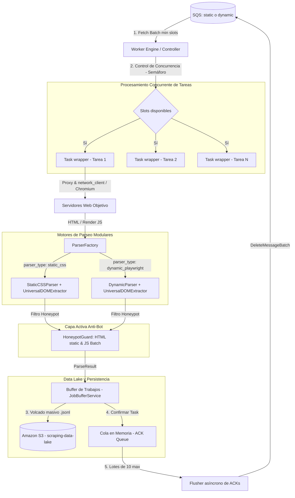
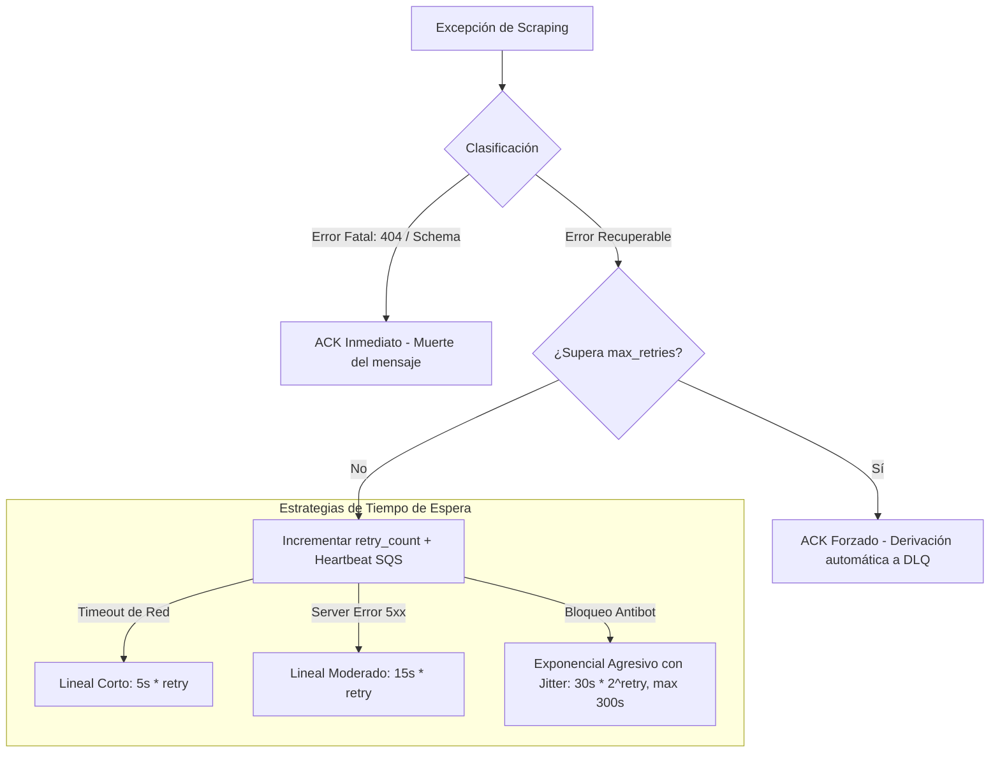

# Worker — Motor Concurrente de Extracción y Resiliencia

El **Worker** es el núcleo de ejecución asíncrono y de alto rendimiento del sistema. Su única responsabilidad es consumir tareas de scraping de la cola SQS de manera eficiente, evadir bloqueos de red mediante rotación inteligente de proxies, extraer los datos requeridos utilizando motores de parseado modulares (`UniversalDOMExtractor`) y gestionar la tolerancia a fallos mediante estrategias adaptativas de reintentos y gestión activa de memoria RAM.

---

## 🏗️ Arquitectura del Motor de Ejecución

El Worker está diseñado bajo un enfoque **no bloqueante y concurrente** utilizando el bucle de eventos de `asyncio` y clientes de red asíncronos (`httpx`, `curl_cffi` para peticiones estáticas impersonadas y `Playwright Chromium` para contenido dinámico).



### 1. Control de Concurrencia y Fetch Seguro
Para optimizar el ancho de banda y la capacidad de CPU de la máquina host sin saturarla:
- El motor utiliza un semáforo asíncrono (`asyncio.Semaphore`) configurado por `WORKER_NUM_MAX_CONCURRENT_TASKS`.
- Solo realiza peticiones de lectura a SQS (`fetch`) cuando hay capacidad libre en el semáforo.
- El tamaño del lote de lectura se adapta dinámicamente: solicita un número de mensajes equivalente a los slots libres del semáforo (con un tope de 10 mensajes), maximizando la tasa de procesamiento sin desperdiciar tiempos de visibilidad.
- **Fetch Concurrente Seguro**: La clase `SQSAioBotoAdapter` utiliza `asyncio.gather` y espera a que todas las peticiones de descarga paralelas en el pool asíncrono terminen antes de procesarlas, previniendo fugas de visibilidad y cancelaciones abruptas de sockets.

---

### 2. Protocolo de Apagado Seguro (Graceful Shutdown)
El Worker está preparado para entornos elásticos de contenedores (como AWS ECS o Kubernetes) donde las instancias pueden crearse o destruirse bajo demanda. Captura las señales de terminación del sistema (`SIGINT` y `SIGTERM`) para realizar una desconexión controlada:
1. Cambia el estado interno a `running = False` para **detener la recepción de nuevos mensajes de SQS**.
2. **Espera a que todas las tareas de scraping en vuelo finalicen** su ejecución de forma limpia.
3. Cierra el buffer de trabajos (`JobBufferService`), realizando un volcado síncrono de los datos almacenados en memoria (**drenado de RAM**) hacia S3 para todos los trabajos activos para prevenir la pérdida de datos volátiles.
4. Encola las tareas correspondientes en la cola de borrado de SQS (`ack_queue`) y espera a que el flusher asíncrono de ACKs termine de vaciar la cola.
5. Cierra las conexiones y sockets del cliente de almacenamiento (S3) y de SQS de forma limpia.

---

### 3. Vaciado Asíncrono de ACKs (`_ack_flusher`)
En lugar de emitir una petición de borrado de red a SQS por cada mensaje procesado con éxito, el Worker los deposita en un buffer en memoria (`asyncio.Queue`). Una tarea en segundo plano consume este buffer y elimina las tareas de SQS **en lotes optimizados de hasta 10 mensajes** (`acknowledge_batch`), reduciendo la latencia de red.

---

## 🛡️ Capa Activa de Seguridad Anti-Bot (`HoneypotGuard`)

Para evitar trampas invisibles diseñadas para detectar scrapers, el microservicio integra la clase [`HoneypotGuard`](scraping/security/honeypot_guard.py), inyectada mediante el contenedor de dependencias (`dependencies.py`) y la factoría (`factory.py`):

- **Análisis Estático (BeautifulSoup):** Evalúa e intercepta nodos `bs4.Tag` con reglas CSS de ocultación (`display:none`, `visibility:hidden`, `opacity:0`, `font-size:0`, `left:-9999px`, `width:0`), clases invisibles (`hidden`, `sr-only`, `d-none`), atributos `aria-hidden="true"`, `tabindex="-1"`, bloques `<noscript>` o enlaces vacíos/javascript.
- **Análisis Dinámico Optimizado en Lote (Playwright):** Ejecuta **1 sola evaluación en lote mediante JavaScript en Chromium** (`page.evaluate`), analizando en C++/V8 todos los elementos de la página (`display`, `visibility`, `opacity`, `pointerEvents`, dimensiones `width/height > 1px`, coordenadas `x/y >= 0`) y devolviendo los locators seguros en **~15 milisegundos**.

---

## 🚀 Motor Dinámico Playwright & Gestión de Recursos V8

El motor dinámico (`DynamicParser`) permite renderizar aplicaciones SPA y contenido JavaScript complejo garantizando estabilidad de memoria RAM:

- **Reciclaje Automático por Contador de Tareas**: Tras procesar 25 tareas (`playwright_max_tasks_per_browser`), el Worker auto-destruye y reinicia el proceso Chromium de fondo, ejecutando `gc.collect()` para liberar fugas de memoria del motor V8.
- **Límite Estricto V8 Heap (RAM)**: Inyecta banderas de arranque en Chromium (`--js-flags=--max-old-space-size=512`, `--disable-gpu`, `--disable-software-rasterizer`) limitando la RAM asignable por pestaña a **512 MB**.
- **Coherencia de Client Hints**: Inyecta dinámicamente cabeceras de contexto (`Sec-Ch-Ua-Platform: "Windows"`) y versionado real de Chromium para eliminar inconsistencias entre el sistema operativo host del contenedor (Linux/Docker) y el navegador renderizado.

---

## 🛡️ Tolerancia a Fallos y Backoff Dinámico

El scraping web está expuesto a fallos constantes de red. El Worker clasifica las excepciones para responder de manera inteligente mediante el recalculo del **Visibility Timeout** del mensaje en SQS:



- **Errores Fatales** (`ErrorCategory.NOT_FOUND` / `INVALID_SCHEMA`): Se consideran no recuperables. El Worker emite un ACK forzado de inmediato para eliminar el mensaje de la cola principal.
- **Errores Recuperables** (`TIMEOUT`, `SERVER_ERROR` 5xx, `BLOCKED` antibot):
  - Incrementan el contador interno de intentos (`retry_count`).
  - Si superan `max_retries`, se eliminan de la cola principal (provocando el traspaso automático a la **DLQ**).
  - Si aún quedan intentos, se modifica la visibilidad del mensaje en SQS mediante un latido (`visibility_timeout`):
    - **Timeout de red**: Backoff lineal corto (`5s * retry`).
    - **Fallo del servidor (5xx)**: Backoff lineal moderado (`15s * retry`).
    - **Bloqueo / Antibot (`BLOCKED`)**: Backoff exponencial agresivo (`30s * 2^retry`, tope de 300s).

---

## 🌐 Sistema de Rotación y Gestión de Proxies

El módulo de red (`BaseProxyProvider`) soporta dos modalidades de rotación:

### A. Pool de Proxies Estáticos (`static_pool`)
- Rota las peticiones de forma equilibrada a través de la lista `PROXY_STATIC_LIST`.
- **Sticky Sessions**: Si la tarea incluye `sticky_session_id`, el sistema calcula un hash consistente y asocia siempre la tarea al mismo proxy del pool.

### B. Gateway Residencial Rotativo (`backconnect`)
- Canaliza el tráfico a través de un único endpoint configurado en `PROXY_URL`.
- **Sticky Sessions**: Inyecta dinámicamente el identificador de sesión en las credenciales de autenticación del proxy.

### C. Cierre Gracioso de Sesiones (Graceful Session Closure)
- El `SecureNetworkClient` retira la sesión del pool y la cierra de forma asíncrona tras un periodo de gracia para no interrumpir peticiones en vuelo.

---

## 🛠️ Configuración y Variables de Entorno

El comportamiento del Worker se controla mediante `config/settings.py` alimentado por el archivo `.env`:

| Variable | Tipo | Por Defecto | Descripción |
| :--- | :--- | :--- | :--- |
| `WORKER_NUM_MAX_CONCURRENT_TASKS` | `int` | `10` | Concurrencia máxima (Semáforo) por Worker |
| `NUM_MAX_TASKS` | `int` | `10` | Lote máximo de borrado y fetch (límite SQS 10) |
| `DEFAULT_REGION_AWS` | `str` | `us-east-1` | Región AWS por defecto del sistema |
| `SQS_ENDPOINT_URL` | `str` | `http://localhost:9324` | Endpoint del broker SQS |
| `SQS_QUEUE_URL` | `str` | `...` | URL física de la cola SQS consumida (estática/dinámica) |
| `SQS_REGION` | `str` | `us-east-1` | Región AWS de la cola SQS |
| `S3_ENDPOINT_URL` | `str` | `http://localhost:9000` | Endpoint de S3 Data Lake |
| `S3_BUCKET_NAME` | `str` | `scraping-data-lake` | Nombre del bucket destino (Data Sink) |
| `S3_PREFIX_RAW_DATA` | `str` | `raw-data` | Prefijo virtual de S3 para datos crudos |
| `S3_REGION` | `str` | `us-east-1` | Región AWS de S3 |
| `PLAYWRIGHT_MAX_TASKS_PER_BROWSER` | `int` | `25` | Reciclaje automático de Chromium cada N tareas procesadas |
| `PLAYWRIGHT_V8_MAX_OLD_SPACE_SIZE_MB` | `int` | `512` | Límite máximo de Heap JS por pestaña Chromium en MB |
| `PROXY_ENABLED` | `bool` | `False` | Activa/Desactiva el uso de proxies de red |
| `PROXY_MODE` | `str` | `static_pool` | Modo de proxies (`static_pool` o `backconnect`) |
| `PROXY_STATIC_LIST` | `str` | `""` | Lista de proxies estáticos separados por comas |
| `PROXY_URL` | `str` | `""` | Dirección completa del proxy backconnect residencial |

---

## 🚀 Cómo Empezar a Desarrollar

### 1. Instalación de dependencias locales
```bash
cd worker
uv sync
```

### 2. Ejecución en desarrollo
Para arrancar el consumidor de colas estáticas:
```bash
SQS_QUEUE_URL=http://localhost:4566/000000000000/scraping-tasks-static uv run python main.py
```
Para arrancar el consumidor de colas dinámicas (Playwright):
```bash
SQS_QUEUE_URL=http://localhost:4566/000000000000/scraping-tasks-dynamic uv run python main.py
```

### 3. Ejecutar la Suite de Pruebas
El Worker incluye **76 pruebas unitarias e integración asíncronas**:
```bash
uv run pytest
```
